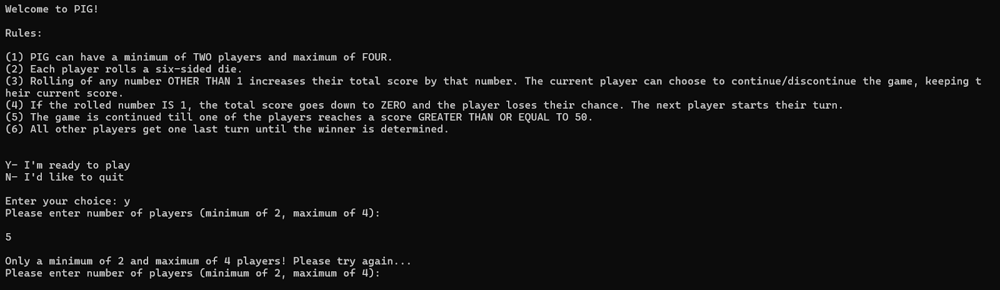
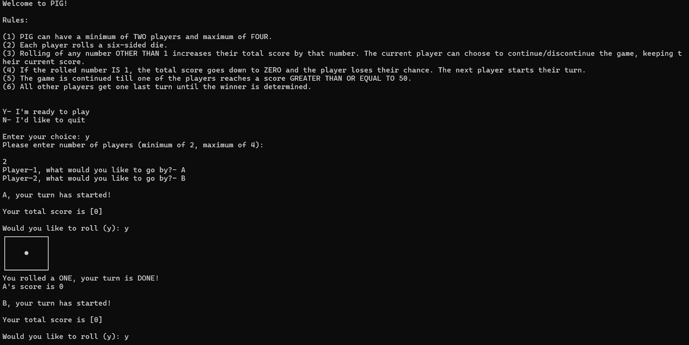
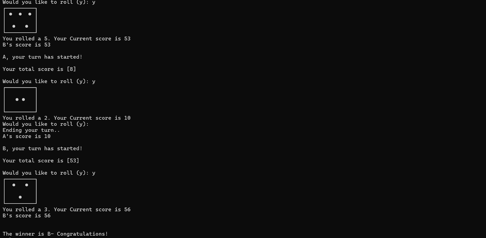

# 🎲 Pig Dice Game (Python + MySQL)

A multiplayer command-line dice game built in Python, with player scores tracked and persisted using a MySQL database.

## About

This project was built as a school Computer Science project to apply core programming concepts — functions, control flow, and database integration — to a real, working application.

## How to Play

- 2–4 players take turns rolling a die.
- Each roll adds to the player's **current turn score**.
- A player can choose to **bank their points** at any time and end their turn.
- Rolling a **1** wipes out all unbanked points for that turn — high risk, high reward.
- First player to reach **50 points** wins the game.

## Features

- 🎲 ASCII-art dice rendering in the terminal
- 👥 Supports 2–4 players in the same session
- 🗄️ Player names and scores stored in a MySQL database (so scores persist across turns)
- 🏆 Automatic winner detection at game end

## Tech Stack

- **Language:** Python 3
- **Database:** MySQL (via `mysql-connector-python`)

## Project Structure

```
├── main.py      # Game loop — handles turns, rolling, and win condition
├── myfns.py     # Core functions — dice rendering, rolling, and all MySQL operations
└── rules.txt    # Game rules shown to the player at the start (create this yourself)
```

## Setup & Installation

1. **Install Python 3** if you don't already have it.
2. **Install MySQL** and make sure the server is running locally.
3. **Install the MySQL connector for Python:**
   ```bash
   pip install mysql-connector-python
   ```
4. **Update the database credentials** in `myfns.py` (currently set to `user="root", passwd="mysql"`) to match your own local MySQL setup.
5. **Create a `rules.txt` file** in the same folder, containing a short description of the rules (this gets printed to the player before each game).
6. **Run the game:**
   ```bash
   python main.py
   ```

## Sample Output

**Rolling the dice:**



**Gameplay in progress:**



**Declaring a winner:**



## What I Learned

- Structuring a project across multiple files (`main.py` + a functions module)
- Using MySQL from Python to persist application data
- Managing game state and control flow with loops and conditionals

## Future Improvements

- Add a turn timer
- Build a graphical user interface (GUI)
- Add more games to the same application

---
*Built as a school project under the guidance of my Computer Science teacher.*
